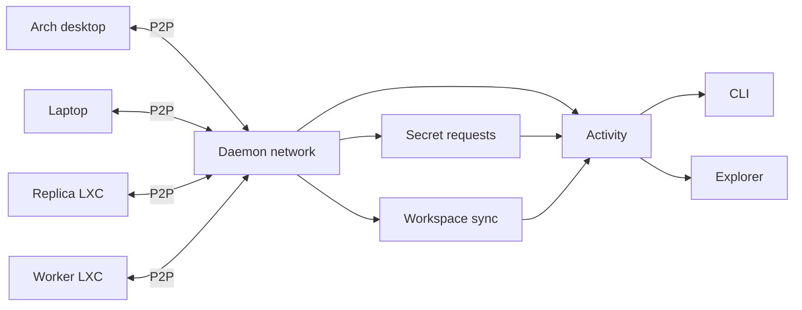
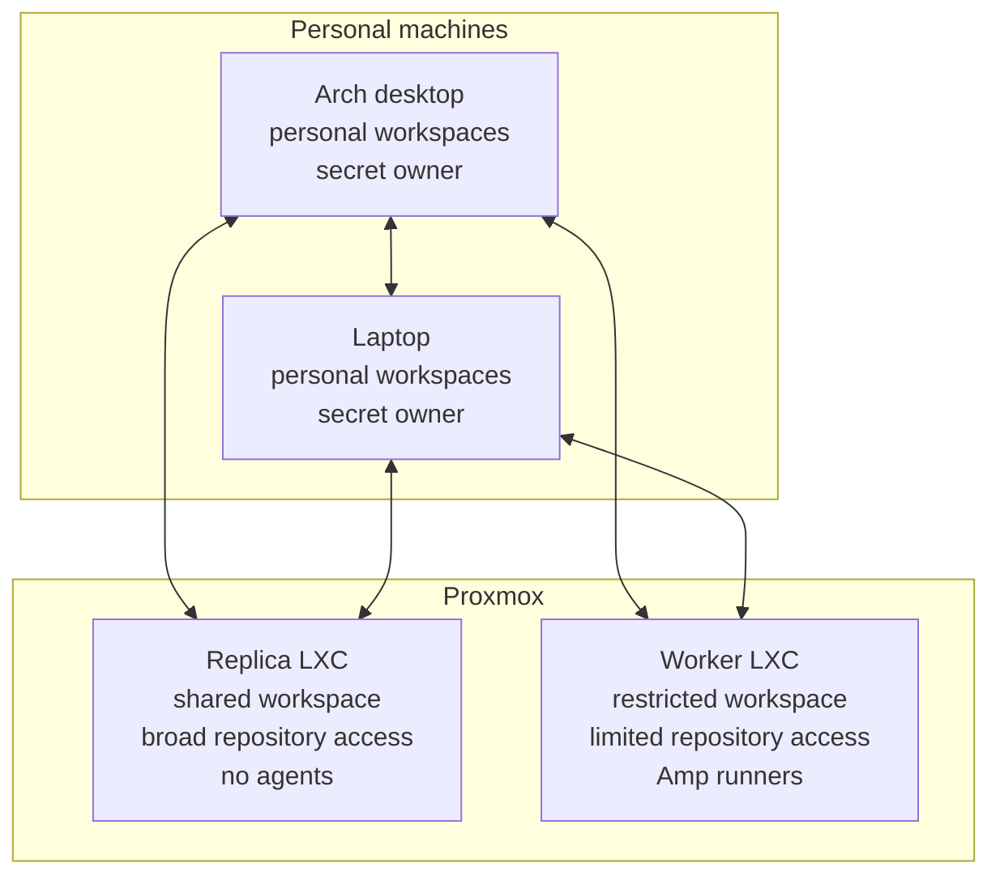

# P2P suite

`ws` already knows how to pair trusted devices and share workspaces between
them. The P2P suite turns that connection into an always-available part of the
development environment.

I use `ws` on an Arch Linux desktop, a laptop, and a Proxmox server. Proxmox can
run several isolated LXC containers. One can keep a replica of my shared
workspace. Another can hold a smaller worker workspace with a limited set of
projects and Amp runners.

I want these machines to find each other, keep shared state moving, and ask each
other for credentials when a new environment needs them. I do not want to
manually start a listener, find a token file, copy a value, fix its permissions,
and restart a runner every time I prepare another machine.

The suite has three parts:

- [Daemon](daemon.md) keeps every peer reachable and coordinates background
  work.
- [Activity](activity.md) keeps a durable history of what happened and exposes
  actions that still need a decision.
- [Secrets](secrets.md) lets a peer request a secret without knowing which
  device owns it.

Every daemon is its own peer. Two LXC containers on one Proxmox host are still
two devices with different identities, workspace access, and credentials. In
version one, one device identity belongs to one trusted network.

Arch and the laptop can both own secrets. The Proxmox nodes can request them.
This is only the common case, not a permanent owner/consumer split: any peer may
store a secret, and any peer may ask for one.

A normal flow looks like this:

1. Daemons discover previously paired peers and reconnect.
2. Shared workspaces synchronize in the background.
3. A worker asks the network for a GitHub credential.
4. The worker sends the request directly to reachable peers without knowing
   which one owns the secret.
5. Arch and the laptop create pending approvals because they own that secret.
   Other peers answer `NOT_FOUND`; an offline peer stays unanswered while the
   worker retries the pending request.
6. Activity shows the pending request and sends a notification.
7. I approve it on either owning machine.
8. The secret is encrypted for the worker and installed using the worker's
   local destination profile.
9. Activity keeps the request and its final result.

The replica and worker receive different GitHub credentials. The replica may
need broad repository access if it also keeps Git repositories available. The
worker receives a separate token limited to its selected repositories. Broad
repository access does not mean account, organization, workflow, secret, or
repository administration access.

The suite continuously moves workspace metadata and Git state already published
to configured remotes. A replica can clone missing repositories, fetch refs and
tags, and safely fast-forward clean main worktrees. Git commits that exist only
on one machine still need a later P2P Git transfer feature. Dirty files and
editor state need another design because copying them can overwrite active work
or capture secrets.

The suite does not create its own VPN, relay service, or NAT traversal layer.
Peers need IP reachability through the local network or an existing overlay.
Local discovery and remembered working endpoints decide how they reconnect.

The daemon runs the suite, but it does not make every decision. Activity shows
what happened and what needs attention. Secret owners decide whether to release
a value. Workspace conflict rules continue to decide when automatic sync is
safe and when the user must choose.
