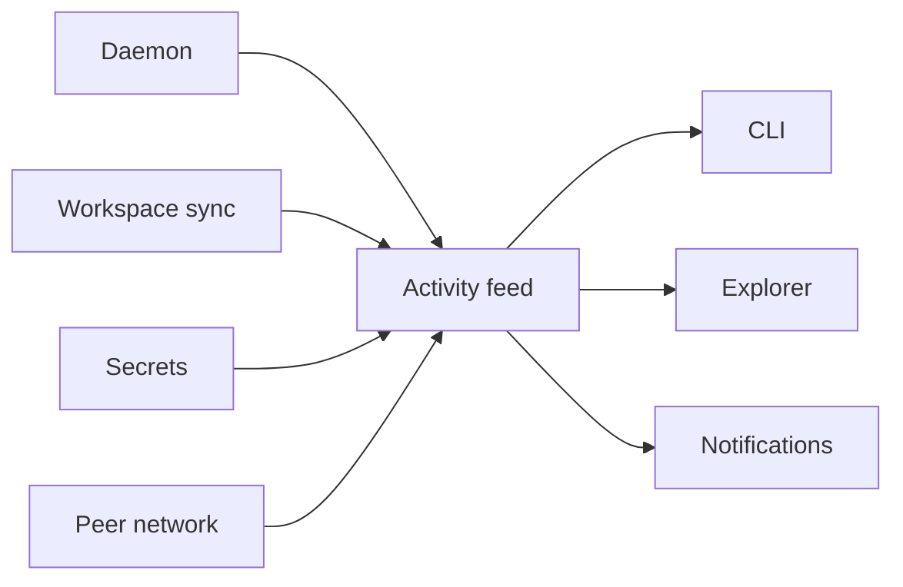
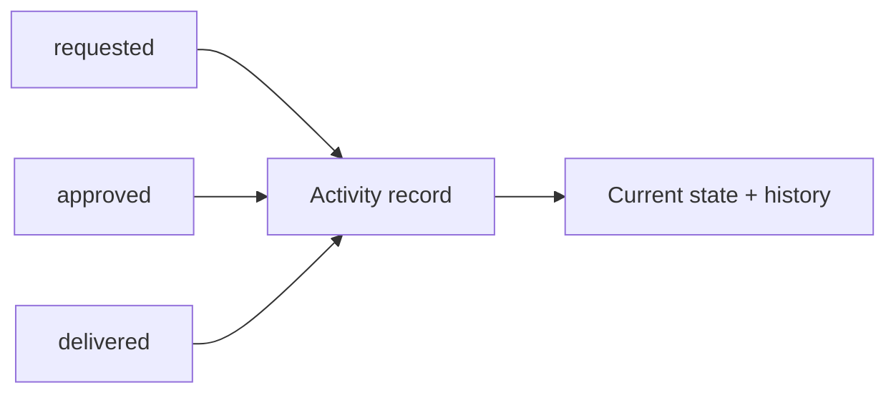

# Activity

Activity is the durable story of the P2P suite. It shows what happened across
devices and keeps requests that still need a decision.

Closing Explorer does not clear Activity. Restarting the daemon does not clear
it either. Records stay indefinitely for now.

Activity does not control workspace, peer, or secret state. Each feature owns
its records and rules. Activity observes their actions and keeps a local,
durable view of what happened.

## What appears in Activity

Activity records meaningful actions, not transport noise.

Examples:

- a device was paired or removed;
- a peer stayed unavailable long enough to block an operation, or recovered;
- a workspace synchronized or found a conflict;
- a secret was requested, approved, rejected, delivered, cancelled, or marked
  stale;
- the daemon started, stopped, upgraded, or hit a blocking error.

Heartbeats, packets, discovery polls, and every retry do not belong in the feed.
Short connection changes and laptop network flaps do not belong there either.
They can live in current status, logs, or metrics.

Repeated attempts update one operation entry with an attempt count, last attempt
time, and latest safe error. They do not create a new permanent row for every
retry. Activity keeps domain transitions; bounded logs keep transport detail.

## One feed, different visibility

Every peer builds its local feed from records and actions it is allowed to see:

- local events stay on the device;
- network records reach active peers in that network;
- workspace records reach only devices allowed to access that workspace;
- secret requests and responses follow the Secrets visibility rules;
- each receiving feature writes its own local Activity entry.

This means two devices may show different Activity feeds without disagreeing.
Each one sees the part of the shared story it is authorized to receive.

Activity entries themselves are not broadcast as a second copy of the same
operation.

## Entries and updates

An Activity entry points back to the feature record or local operation that
created it. A secret request, for example, begins with `requested` and later
receives `approved`, `delivered`, or `stale` updates from Secrets. The feed
presents the latest useful state while preserving meaningful source
transitions. Retry attempts remain an aggregate instead of becoming history
rows.

Every entry uses a stable source identity:

- its own local Activity ID;
- source feature and record kind;
- stable source record ID and source-defined perspective, such as requester or
  owner;
- source version and unique transition ID;
- optional operation or request ID for correlation;
- the device, workspace, project, or conflict involved;
- source-defined state and safe display data;
- transition occurrence time and local observation time.

Activity has no universal domain state machine. Secret request states,
workspace conflict heads, project conflicts, network conflicts, access
conflicts, and foreground job results keep their own identities and rules. A
source deadline may be copied for display, but Activity timestamps never decide
expiry.

Conflict identity also stays feature-specific. Project conflicts use their
stable conflict key, workspace conflicts use revision and path, and network or
access conflicts use their deterministic domain ID. Activity does not merge
these into one generic conflict ID.

The source feature verifies signatures, ordering, authorization, and valid state
transitions before Activity shows the result. Activity does not make those
decisions from timestamps.

## Actions inside the feed

Activity actions come from each feature's contract. Activity is not a generic
remote command launcher.

A pending secret request can offer:

- `Approve request`;
- `Reject request`.

A stale request shows its result but offers no decision. A workspace conflict
can open its resolution flow. A temporary failure can offer `Retry` only when
retry is safe and supported.

Selecting an action calls the feature that owns it with the source reference
and expected version. The feature reloads the current record and rechecks its
state, version, authorization, and deadline before doing anything. A stale
button returns a stale-action result instead of changing newer state.
`Approve request`, for example, calls Secrets. Secrets stores the decision, then
Activity records the result. The Activity entry never changes feature state by
itself.

## Explorer

Explorer uses the durable feed instead of a list that exists only in the
current process. New foreground jobs created after durable Activity exists can
appear beside background sync and secret requests. Existing process-local job
IDs cannot recreate history from older Explorer sessions.

The default view shows newest records first and makes pending decisions easy to
find. Opening a record shows:

- who or what created it;
- which device and workspace it belongs to;
- its current state;
- relevant timestamps;
- its event history;
- available actions;
- a safe error message when something failed.

Search and filters can narrow the feed by device, workspace, feature, state, or
time. They do not change retention.

## Read and attention state

Read, unread, and dismissed are local presentation state. They do not
synchronize to other devices and do not change the source feature. Reading a
secret request does not approve it, and dismissing a workspace notification
does not resolve its conflict.

Opening an item records its current source version as read. A later meaningful
source transition makes it unread again. Dismissal also belongs to a particular
source version; it does not suppress a later update.

`Needs attention` comes from the current feature state, not from the unread
flag. A pending approval or unresolved conflict remains easy to find after its
entry has been opened. When the feature reaches a terminal state, Activity
removes its action while preserving the record and history.

## Recovery and access changes

The source feature commits its state before Activity treats a projection update
as final. Projection writes are idempotent by source record and transition ID.
When source state and Activity share one SQLite database, they update in one
transaction where practical. Otherwise startup scans durable source records and
replays any version or transition missing from Activity.

Removing workspace or network access stops new updates and disables actions on
records that are no longer authorized. History already stored on that device
remains as a local record of what it previously observed.

## Notifications

Notifications point back to Activity. Several repeated updates for one record
should update or group one notification instead of flooding the desktop.

Notifications never contain secret values or unrestricted command output. A
notification click opens the record; it does not execute its action.

## Sensitive data

Activity never stores:

- secret values;
- encrypted secret payloads;
- credential-bearing URLs;
- environment dumps;
- arbitrary command output that may contain credentials.

It stores safe metadata: event IDs, device names and IDs, workspace references,
secret aliases, states, timestamps, decisions, and sanitized errors.
