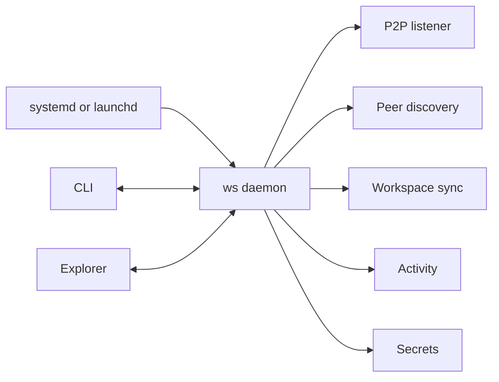
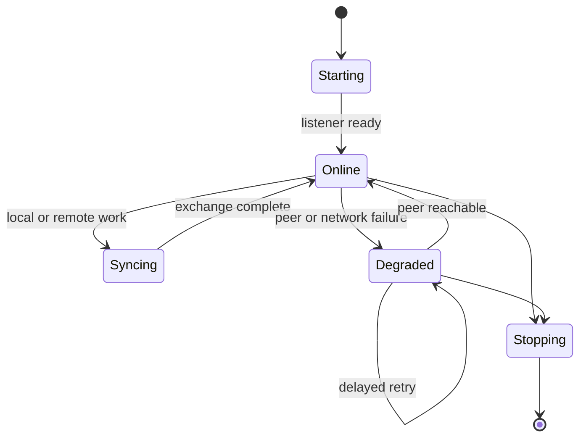
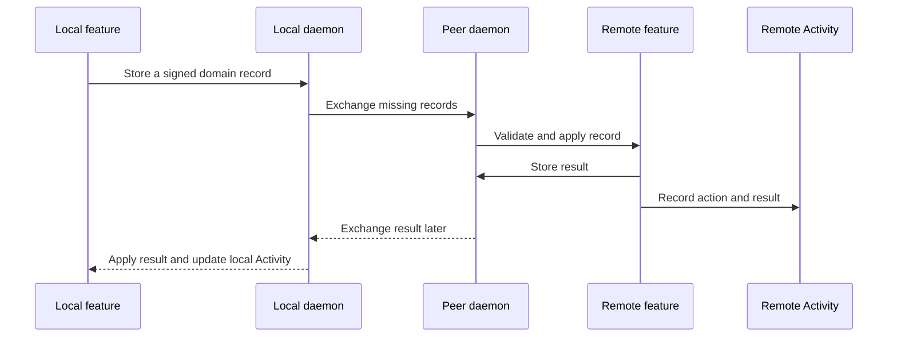

# Daemon

The daemon keeps one `ws` peer available in the background. It starts with the
owner's user session, listens for trusted peers, reconnects after network
changes, and moves authorized data without waiting for a foreground command.
Headless Linux can enable user-service lingering when it must start before an
interactive login. A macOS LaunchAgent starts after login.

One daemon runs for one local `ws` identity. Every LXC has its own daemon and
device identity, even when several containers share one Proxmox host.

On a secret-owning machine, a small vault helper uses the owner account's
credential store. It is not another peer or general daemon: it has no network
listener, does not synchronize workspaces, and exposes only the narrow Secrets
operations described in [Secrets](secrets.md).

## Staying connected

Always available does not require one permanent TCP connection to every peer.
The daemon keeps a listener open and reconnects when it has work to send.

The daemon assumes peers already have IP reachability through a LAN or an
existing overlay network. It does not provide a VPN, public rendezvous service,
or NAT traversal. mDNS discovers peers on the local subnet. The daemon also
remembers working endpoints so a temporary discovery failure does not stop a
known peer from reconnecting. The listener remains available when mDNS is
degraded.

It reacts to:

- a local workspace change;
- a new domain record that needs delivery;
- a change hint from another peer;
- a secret request or response;
- a peer becoming reachable;
- a periodic check that repairs missed notifications;
- an explicit `ws sync` request;
- startup after a crash or reboot.

Short connections make sleep, laptop movement, daemon restarts, and temporary
network failures ordinary events. The daemon retries temporary failures with a
delay. Authorization failures and incompatible protocol versions stay visible
in Activity instead of retrying forever at high speed.

Short-lived records such as secret requests use direct fanout. The requester
keeps its pending record and retries reachable peers until the request becomes
terminal or expires. A non-owner does not become a durable relay.

## Moving workspace and published Git state

When two connected peers share a workspace, the daemon exchanges its signed
registry revisions. Each workspace keeps its own access rules. Pairing two
devices does not expose every workspace between them.

One scheduled exchange is enough because workspace sync is bidirectional. For
each peer pair, the device with the lower device ID initiates the exchange. The
other device sends it a wake request instead of starting a competing exchange.
This prevents two simultaneous exchanges from replacing each other's staged
imports.

The daemon forwards existing revisions and lets the workspace merge rules do
their job. It does not turn a conflict into a last-write-wins update. A conflict
becomes an Activity item and waits for the existing resolution flow.

After registry sync, the daemon keeps the workspace's published Git state
available locally. It can:

- clone a selected repository that is missing on this device;
- fetch refs and tags already published to the configured remote;
- fast-forward a clean, behind-only main worktree;
- record dirty, locked, diverged, or inaccessible repositories in Activity.

This is how a Proxmox replica uses its broad repository credential. A restricted
worker performs the same operations only for projects in its smaller workspace.

The daemon does not convert Git remotes, push branches, push mirrors, merge,
rebase, reset, force-update, or overwrite dirty worktrees in the background.
Local-only commits, unpublished refs, stashes, and dirty files do not reach the
replica through GitHub. They belong to a later direct P2P Git/WIP design.

Each device chooses a machine-local `git_mode` for every workspace. This setting
is different from the replicated workspace access role named `replica`:

- `git_mode=replica` clones and fetches published Git state, then safely
  fast-forwards a clean, behind-only main worktree;
- `git_mode=active` clones missing repositories and fetches published state, but does
  not change an existing checkout in the background.

Desktop, laptop, and worker nodes normally use `git_mode=active`. A Proxmox node
without agents can use `git_mode=replica`. A local explicit sync may review and
apply a safe fast-forward on an active device; a remote trigger cannot change
that checkout.

## Triggering synchronization

Mutating `ws` commands wake the daemon after committing local state. Registry
head changes start workspace exchange. `ws worktree push` sends a small
project-change hint immediately. The hint contains no Git data and only asks
peers to check the project through its configured remote.

Reconnect starts a comparison of registry heads and pending records. A periodic
sweep catches plain Git pushes, remote changes made by CI or a web UI, lost
hints, and work left incomplete by a crash. Hints make sync fast; startup and
periodic comparisons make it reliable.

`ws sync` keeps its local foreground review, selection, remote-conversion,
mirror, and cancellation behavior. It asks the daemon to exchange registry state
and sends a deduplicated wake request to reachable peers, then continues with
the current foreground Git flow. A remote peer runs only its background-safe
policy. Closing the CLI cancels the local foreground phase; peer cycles already
accepted by daemons continue and report their result through Activity.

The scheduler allows one active cycle per workspace. New triggers during a run
collapse into one later run. Wake hints use a short debounce, duplicate record
IDs are ignored, and a received result does not trigger an endless sync loop.
Temporary failures use backoff, while reconnect schedules an immediate retry.

## Coordinating local Git operations

The daemon runs at most one operation for a repository at a time. Before a
clone, fetch, or fast-forward, it acquires the same local cross-process
repository lock used by foreground `ws` commands. An active bootstrap, migrate,
add, or other workspace-wide operation also blocks background sync for that
workspace.

A busy lock makes the daemon skip that repository and retry later. It does not
cancel unrelated repositories and does not create a new Activity entry for
every attempt. Activity shows one blocked operation only when the condition
persists or needs attention.

Plain Git commands do not know about the `ws` lock. Immediately before changing
a replica worktree, the daemon therefore reloads its head, upstream, dirty
state, and Git lock state. It updates only the expected clean, behind-only head.
If anything changed since planning, Git rejects the update or the daemon skips
it. The daemon never removes a Git lock file or overwrites the concurrent work.

## Coordinating the suite

The daemon carries each feature's records between peers and wakes the receiving
feature:

This path carries workspace revisions, secret requests, owner responses, and
encrypted deliveries. Each feature owns its records and state transitions.
Activity observes those changes locally; it is not another replicated protocol.
The daemon only schedules work, transports records, and reports results.

## Talking to `ws`

`ws` and Explorer talk to the daemon through a local Unix domain socket. The
socket carries a small versioned request and event protocol. It is not exposed
to the P2P network.

For an ordinary local mutation, `ws` commits its registry transaction first and
then sends the daemon a wake message with the workspace and observed revision.
The message is only a hint; it does not carry the revision itself. If the daemon
is unavailable, the local command still succeeds and reports that background
sync is unavailable. Startup and periodic comparison find the committed change
later.

Network operations belong to the daemon. Commands such as `ws sync`, peer
status, Activity watch, and secret request send a typed request through the
socket. A long operation receives an operation ID and can stream safe progress
events. Closing the CLI does not cancel accepted background work; its result
remains in Activity.

After `ws worktree push`, the CLI sends an immediate Git-published hint. The
daemon verifies repository state itself before notifying peers. A plain Git
push that bypasses `ws` is found by the periodic sweep.

Every mutating or long-running request has a request ID, so reconnecting a
client can repeat it without starting the same operation twice. Before replying
`accepted`, the daemon stores that explicit operation locally. Status, reads,
watches, wake hints, and ordinary periodic cycles do not need durable request
deduplication. Client and daemon first negotiate a protocol version. The exact
wire encoding can change without changing this contract.

The daemon gets the caller identity from Unix peer credentials, not from a
client-supplied field. The ordinary socket can request sync and secrets and read
allowed status and Activity, but it cannot read the vault or approve a secret.
Those operations require a local owner action through the vault helper described
in [Secrets](secrets.md).

The daemon never starts a CLI process to report an event. Explorer and
`ws activity watch` subscribe to its event stream; short commands use one
request and response. Starting or restarting an unavailable daemon goes through
the local service manager because there is no daemon socket to call.

Help, completion, and unrelated read-only commands do not start networking as a
side effect. If the daemon is unavailable, clients say so instead of starting a
second copy that could race the supervised process.

systemd or launchd supervises the process. Explorer can ask the service manager
to start, stop, or restart it, but Explorer is not the supervisor.

## Restart and recovery

Signed workspace heads and staged imports are already durable. Ordinary
workspace wake hints and scheduler cycles therefore stay in memory; after a
restart the daemon compares heads again instead of replaying a generic work
queue. It reloads explicit accepted operations, Activity state, and pending
secret requests from local storage.

Sending the same record more than once is safe. A connected socket is not proof
that the other side stored anything. The daemon marks work complete only after
the receiving peer acknowledges the exact record.

One failed workspace or secret request does not stop unrelated work. Activity
keeps failures visible, while the daemon continues with other peers and
workspaces.

## Notifications

The daemon sends notifications for events that need attention, such as:

- a new secret request;
- a workspace conflict;
- a peer or workspace that remains blocked;
- a completed setup action the user was waiting for.

A notification opens the matching Activity record. Clicking it never approves
a request or resolves a conflict. When no desktop session exists, the record
still waits in Activity and remains available through CLI and Explorer.
