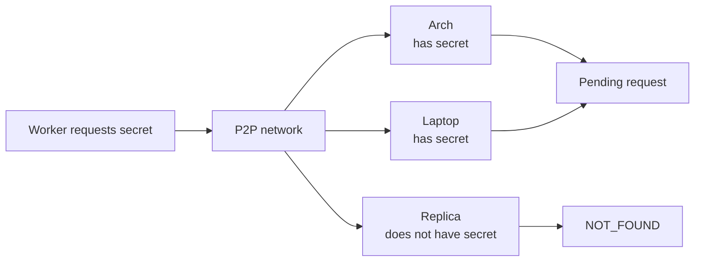
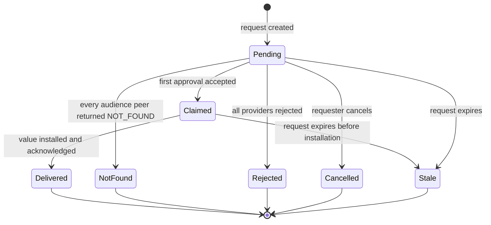
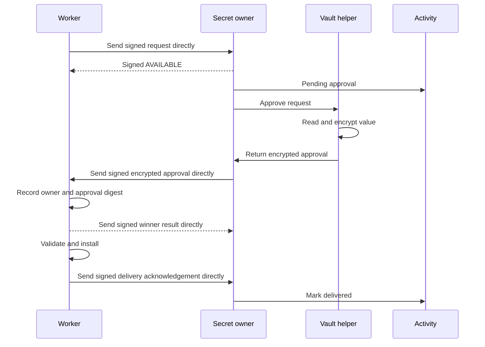

# Secrets

Secrets lets one peer ask the P2P network for a credential without knowing
which device stores it.

Any peer may own secrets. Arch and the laptop can both hold the same GitHub
credential. A Proxmox replica or worker can request it. Another deployment may
use a different ownership pattern without changing the protocol.

## Managing local secrets

The approver principal can put, list, replace, and remove secrets in its local
vault. Secret input uses a masked prompt or protected input stream, never a
command argument, Activity entry, or log line.

Each ID has one current local value. Putting another value under the same ID
replaces it. New approvals use the new value; an encrypted response that already
exists keeps its original value. The vault does not retain addressable versions.

`secret list` shows only IDs and safe local metadata. It never prints values or
publishes owner inventory to the network. Removing an ID removes local
ownership, so future requests receive `NOT_FOUND` from that peer.

A device-scoped request such as `<device-id>/github/RUNNER_PAT` routes only to
that device, which looks up the local `github/RUNNER_PAT` entry after checking
the prefix.

## Storage and unlock

Each secret value lives directly in the operating system's credential store:
Secret Service on Linux and Keychain on macOS. `ws` does not create another
encrypted vault format or keep a separate master key.

The helper keeps a local index of secret IDs and safe metadata. IDs are not
confidential, so this metadata can remain outside the credential value. It lets
the helper answer whether one exact requested ID exists while the credential
store is locked. The ordinary daemon can make that exact lookup but cannot list
the index through the helper API.

The index is advisory because the credential store and local database cannot
share one transaction. Approval checks the credential store again. A missing
value repairs stale metadata and returns an unavailable result, not a user
rejection or successful delivery.

An incoming network request never opens an unlock prompt. When an ID exists,
the owner returns `AVAILABLE` and Activity can show that the vault is locked.
Putting, replacing, removing, or approving a secret asks the operating system
to access the credential through a local approver action. If the credential
store stays locked, the action waits or fails without releasing a value.

The helper keeps plaintext only in memory for the local operation and does not
intentionally retain it afterward. It returns an end-to-end encrypted approval
to the daemon, not the credential-store item or plaintext value. Credential
values and their local metadata never synchronize through P2P.

Version one trusts the owner operating-system account. Another process running
as that same account may be able to use an unlocked Secret Service or Keychain
directly, outside the helper API. The helper protects the network protocol and
prevents ordinary clients from releasing values by accident; it is not a hard
security boundary against a compromised same-user process. Strong isolation
requires running agents under another OS identity or sandbox and belongs to a
separate design.

There is no vault recovery format in version one. Losing the credential-store
contents loses the stored values unless the operating system restores them.
`ws` does not depend on that recovery. Delivered credentials should be
replaceable PATs, API keys, or similar values that can be revoked and issued
again. Permanent secrets and recovery codes remain in an external password
manager.

## Asking the network

A requester stores a signed request and sends it directly to reachable peers.
It retries unanswered peers while the request remains pending. Non-owner peers
do not store or forward durable relay copies.



The requester uses a human-readable secret ID. A network-wide ID such as
`github/RUNNER_PAT` asks every peer to check its local store. A device-scoped ID
such as `<device-id>/github/RUNNER_PAT` asks only that device. The requester does
not need an inventory of which peer owns each secret.

Version one gives each device identity exactly one network. Every request
includes that network's ID and a specific signed membership head. Its audience
is derived from the verified active membership at that head instead of trusting
an arbitrary list supplied by the requester.

A peer without a network-wide secret returns `NOT_FOUND`. This is not a user
rejection and does not close the request while another peer may still own it.
For a device-scoped ID, the requester sends to the target; other peers do not
answer for it.

A peer that has the secret immediately returns `AVAILABLE` and creates its
pending approval. The requester can then distinguish an online owner waiting
for a decision from a peer that has not answered.

Before creating and broadcasting a request, the daemon loads signed network
membership, verifies that the requester is active, and refuses to proceed while
that membership has an unresolved conflict. A device-scoped target must also be
active.

Any active peer may request any human-readable secret ID. IDs are not treated as
confidential; approval protects the value. The daemon limits pending requests
per device and allows only one active request for the same requester, secret ID,
and destination profile digest. A duplicate returns the existing request
instead of creating another notification.

The request captures its audience from that membership state. If every peer in
the audience returns `NOT_FOUND`, Secrets closes the request as `Not found`. An
offline peer remains unanswered, so the requester retries it or reaches the
request deadline. A device added later does not become part of an older request.

Every participant checks current membership again before responding, accepting,
or installing. After a requester accepts removal history, it rejects later
responses from that removed peer and no longer waits for it. Removing the
requester makes the request inactive. A partitioned peer that has not learned
the removal may still act on older state, so removal is not instantaneous global
revocation.

Only a peer that owns the secret creates an actionable Secrets record and an
Activity entry. Other peers return their signed `NOT_FOUND` result without
creating a decision in Activity.

Request metadata is visible to trusted daemons because they need it for this
fanout. A non-owner daemon does not expose requests through Activity or its
ordinary local API. An agent on that peer cannot use the daemon API to list the
network's secret requests.

An owner stores its pending decision and signed response long enough to resend
them directly when the requester reconnects. A permanent replica improves peer
reachability, but it does not forward secret records for other peers.

A request includes safe metadata:

- request ID;
- network ID;
- signed membership head;
- exact secret ID;
- requesting device;
- related workspace when there is one;
- reason for the request;
- local destination profile name;
- normalized destination profile digest;
- creation and expiry times;
- a new X25519 public key created for this request;
- the requester's signature.

The request does not contain an arbitrary file path, shell command, or service
name supplied by another machine.

Every state-changing Secrets record uses deterministic canonical encoding, a
record-type signature domain, the request digest, actor device ID, and an
Ed25519 signature. This includes `AVAILABLE`, `NOT_FOUND`, `REJECTED`,
`APPROVED`, `CANCELLED`, winner results, and delivery acknowledgements. Hop-level
TLS does not replace these signatures because records outlive one connection.

Approval and delivery also check current network membership and stop while its
state has an unresolved conflict, even when the original expiry time has not
passed.

## Owning the same secret on several devices

Several peers may own one secret. For example, Arch and the laptop may both be
able to fulfill `github/personal-replica`.

Owners use the same network-wide ID when they intend to answer the same request.
A device-scoped prefix selects one owner when the requester needs a specific
copy.

A network-wide ID names a credential role, not exact bytes. Arch and the laptop
may hold different but suitable PATs under `github/RUNNER_PAT`; the first
accepted approval supplies the value. Use a device-scoped ID when the requester
needs one exact owner's copy.

The requester tracks one response from every peer in the audience:

- `AVAILABLE` means the owner is waiting for a decision;
- `NOT_FOUND` means the peer checked its store and has no matching ID;
- `REJECTED` means an owner refused this request;
- `APPROVED` carries the encrypted value;
- no response means the peer is offline or has not processed the request.

Requester Activity shows aggregate progress without listing owners, such as
`1 provider available, 2 peers unanswered`. It identifies the winning device
after accepting an approval.

Each owner may answer once while the request is still pending:

- approve and send an encrypted response;
- reject on that owner.

One owner's rejection does not close the whole request. Another owner may still
approve it.

The requester installs and records only the first valid approval it accepts. It
atomically stores the winning owner and approval digest before decrypting or
installing the value. The approval already contains the encrypted value, so
delivery no longer depends on the winning owner staying online.

This is a first-installed rule, not exactly-one disclosure. Two owners may
approve concurrently and both encrypted values may already be available to the
requester before it records the winner. Later responses are discarded, but the
protocol does not claim that only one owner released a value.

Another approval that reaches the requester later receives `ALREADY_CLAIMED`.
In a P2P network this means first accepted by the requester, not first click by
wall-clock time. The requester signs and sends the winner result directly to
the request audience so the approval action disappears on every reachable
owner.

If installation fails, the requester retries the winning encrypted response
while the request remains valid. It does not switch owners. Choosing another
owner requires a new request.

## Request lifecycle



Approval and rejection are owner responses attached to `Pending`. The first
accepted approval atomically moves the global request to `Claimed` before the
requester decrypts or installs anything; a rejection affects only that owner.
When every peer has answered, no provider remains available, and at least one
owner rejected, the request becomes `Rejected`.

An expired request becomes `Stale`. It remains in Activity but can no longer be
approved. Retrying creates a new request linked to the stale one.

The signed request carries one absolute `issued_at` and `expires_at` deadline.
The protocol checks that expiry follows issue time, limits the maximum lifetime,
and rejects issue times too far in the local future. Retrying never extends the
signed deadline.

A peer does not approve, accept, or install after its local clock passes the
deadline. It cannot prove that its own clock is correct without an external time
source, so peers near the deadline may briefly disagree. A late response is not
installed.

`Stale` is derived locally from the signed deadline; peers do not need the
requester to come online and publish a separate expiry event. Requests use a
10-minute default lifetime, allow a shorter caller-selected lifetime, and cap
the lifetime at one hour. Peers allow an issue time up to one minute in their
local future.

## Approval and delivery

Approval is available through CLI and Explorer. The owner sees:

- requested secret ID;
- requesting device;
- related workspace;
- stated reason;
- destination profile;
- request age and expiry.

Approval releases the value to that exact device and request. Another device
cannot reuse it. The requester atomically accepts only one winning approval.



Temporary delivery or installation failures can retry while the request is
valid. A failed install does not claim success. `Delivered` is published only
after the value is durably installed.

## Encryption

Peer TLS protects each connection, but a signed response may be stored and
retried after that connection closes. The secret therefore also has end-to-end
encryption bound to its request.

The requester creates a new recipient key pair for every request. A reviewed
HPKE implementation supplies X25519 key agreement, its standard KDF, and
authenticated encryption; `ws` does not invent its own composition. The
requester's existing Ed25519 device identity signs the request, including the
ephemeral public key.

The owner signs the approval and seals the value for that request key. HPKE
associated data binds the ciphertext to the full request digest, network,
requester, owner, destination profile digest, and expiry. A value from another
request or owner therefore cannot be substituted.

The requester keeps the ephemeral private key only while the request can still
receive a response. It stores the key locally so daemon restart does not lose a
pending request, then destroys it when the request reaches any terminal state.
A retry creates a new request and key pair.

If the private key is lost, the response cannot be recovered. The requester
cancels that request and creates another one; there is no device-wide encryption
key to recover or rotate.

The requester rejects a response with the wrong signature, request binding,
owner, profile digest, or expiry. A terminal tombstone keeps the request ID and
accepted approval digest long enough to reject later replays without retaining
the ciphertext.

## Retention and limits

Version one accepts secret values up to 64 KiB. Secret IDs, reasons, profile
names, and other request metadata also have small protocol limits. The requester
rejects oversized metadata before fanout. An owner cannot approve an oversized
local value, and the requester rejects an oversized response before install.

The winning encrypted payload remains available only while delivery may retry.
After delivery, cancellation, rejection, `Not found`, or expiry, peers remove
the ephemeral private key and encrypted payload. They retain only a safe
terminal tombstone for replay rejection. The installed destination file remains
until a later local install or explicit local removal.

Activity keeps safe request metadata and state transitions indefinitely. It
does not keep the private key, ciphertext, plaintext, or previous installed
values.

## Installing a secret

Each receiving device defines local destination profiles. A profile controls
where and how a delivered value is written. Profiles stay on that device and do
not synchronize through P2P.

Before broadcasting a request, the daemon verifies that the named profile
exists and accepts the requested secret ID. The request binds to that local
profile's normalized digest, including its accepted role, format, and
destination. If the profile changes or disappears before delivery, the daemon
does not install the value; the caller fixes the profile and creates a new
request. For a device-scoped secret ID, profile matching uses the credential
role after removing the routing device prefix.

Conceptual example:

```text
profile: github-runner-token
accepts: github/worker-workspace
path: /home/amp/.config/runner-workspace/github.token
format: raw
```

The request names `github-runner-token` and includes its digest. The local
worker already knows the path and format. A remote peer cannot replace those
settings or supply a path, owner, command, or service name.

Version one writes only to directories owned by the daemon user. Installed
files use mode `0600` and the daemon user's ownership. Root-owned destinations,
ownership changes, automatic service restarts, and post-install commands are not
supported.

The receiver opens and verifies the daemon-owned destination directory without
following symlink components. It creates a temporary regular file with mode
`0600` in that directory, writes and flushes it, atomically renames it into
place, flushes the directory, and verifies final type, ownership, and mode. A
failed install leaves the old file unchanged. Retrying the same winning payload
is safe, while a later successful request atomically replaces the old value.
Plaintext version history is not retained.

Version one supports only `raw` profiles, which write the value as the whole
file. Consumers read the installed file when they need the credential. If a
long-running process reads credentials only at startup, restarting that process
is a separate local action in version one.

The profile expresses local installation intent. It cannot prove to the owner
that the requester used the value only at that path. Once the requester decrypts
the secret, software running as that user may copy it elsewhere.

## What delivery means

Secrets delivers the value. It is not an operation broker.

After a PAT is installed for the `amp` user in a worker LXC, agents running as
that user must be treated as able to read and copy it. The suite protects the
rest of the vault by sending only the approved secret.

The practical protection is:

- give the worker a token limited to its repositories and required actions;
- give the replica a different credential;
- keep broad credentials in an LXC without Amp runners when possible;
- bind every approval to one device and destination profile;
- rotate or revoke the provider credential when delivered access must end.

Removing a peer stops future authorized delivery. It cannot erase a token the
peer already received.

If a device identity is lost or compromised, the owner removes that device from
the network, cancels requests involving it, creates a new identity, and pairs it
again. Credentials already delivered to the old device are rotated or revoked.
A partitioned peer may act on membership it has not yet replaced, so removing a
device limits future trusted communication but does not prove instant global
revocation.

The device identity private key stays in a local file with mode `0600` and is
never synchronized. Version one trusts the operating-system account that owns
this file and has no in-place identity-key rotation. Loss or compromise uses the
remove, replace, and re-pair flow above.

## Owner vault

Stored owner values stay outside workspace state, Activity, exports, logs, and
the ordinary daemon process. A small local vault helper uses the owner account's
credential store. It has no P2P listener and does not access workspaces.

An ordinary daemon client can create requests and read its allowed Activity,
but the helper API does not let it list vault contents, approve a request, or
ask the vault to encrypt a value without a matching local approval action.

For an approved request, the helper receives the signed request and its
ephemeral public key, reads the selected value, encrypts it, and returns only
the encrypted response to the ordinary daemon for fanout.

A human approves through the local owner session. A trusted local agent may also
approve, but this grants real power to release every secret available to that
owner account. Moving agents to a separate OS identity later turns the helper
API into an enforced boundary without changing the P2P protocol.

## Activity

Each participant creates safe local Activity entries for Secrets records that
its role is allowed to expose:

- requested;
- approved or rejected by an owner;
- delivery started;
- delivered;
- installation failed;
- cancelled;
- stale.

The request and its result remain visible indefinitely for now. Activity never
stores the secret value or encrypted payload. Secrets remains the source of
truth for request state and valid actions.

## Example Proxmox credentials

The Proxmox replica and worker request different secrets:

- `github/personal-replica` gives the replica access to the repositories it
  keeps available;
- `github/worker-workspace` gives the worker access only to its selected
  repositories and GitHub operations.

A broad repository token still does not need account administration, workflow,
secret, organization-administration, or repository-settings permissions unless
the replica performs a concrete operation that requires them.
